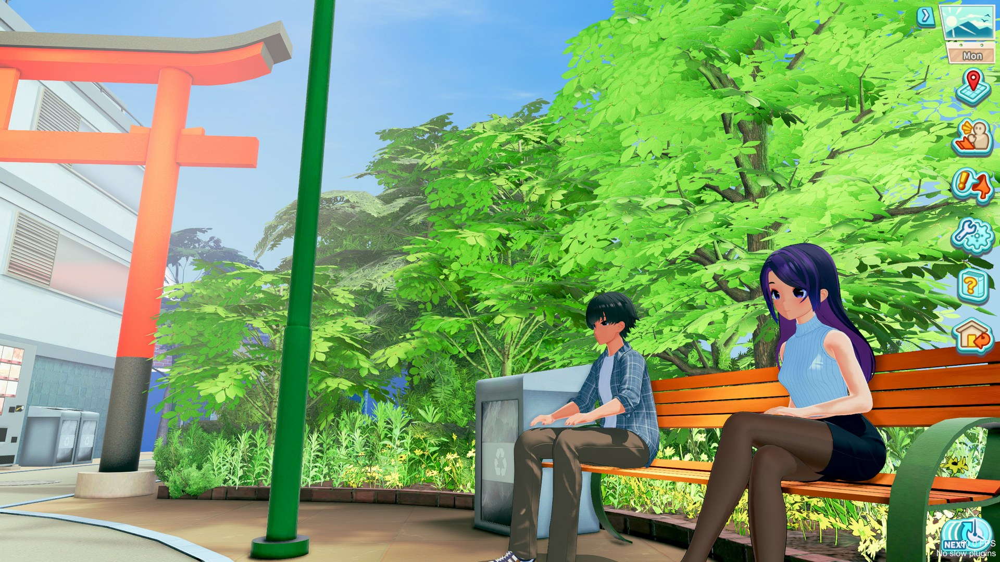
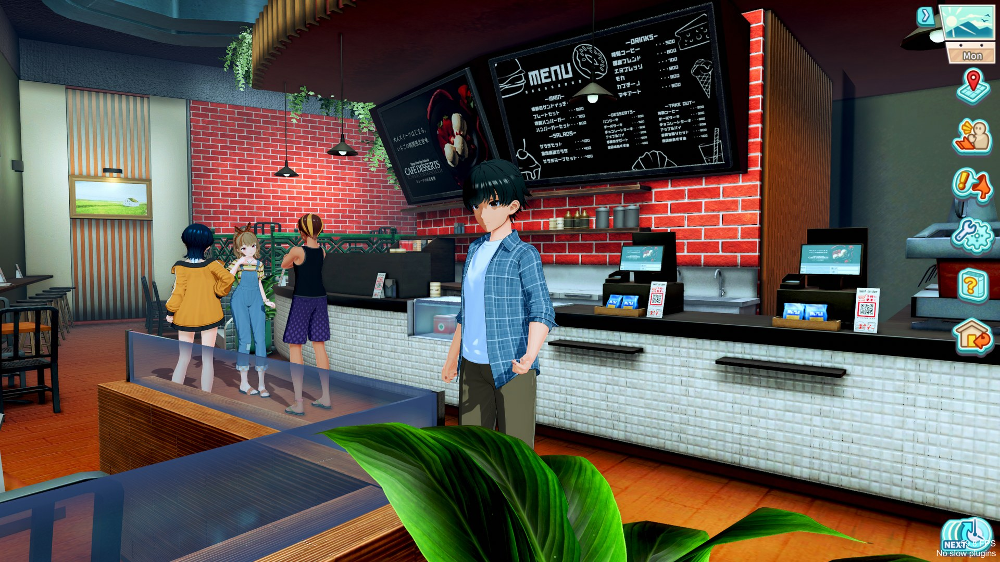
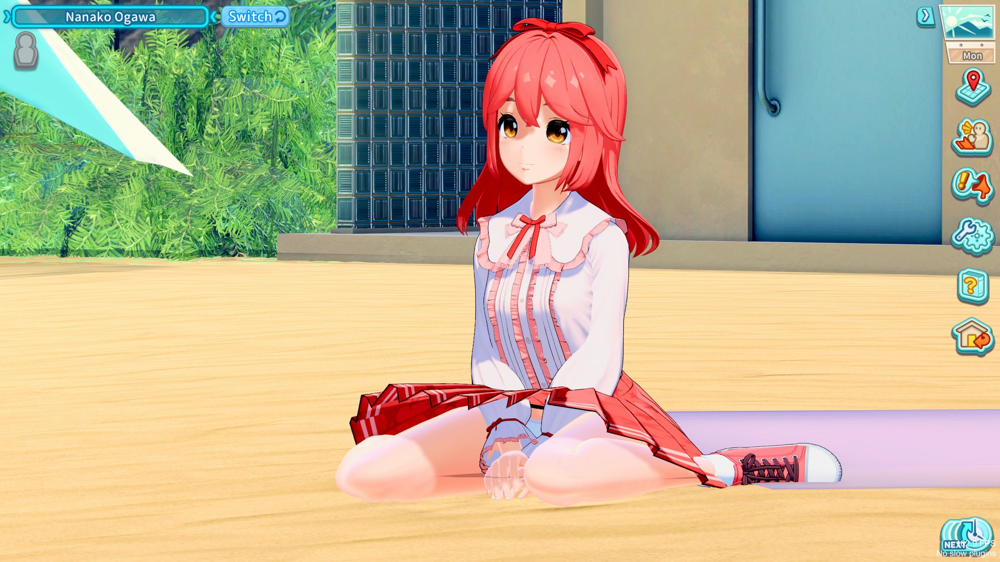
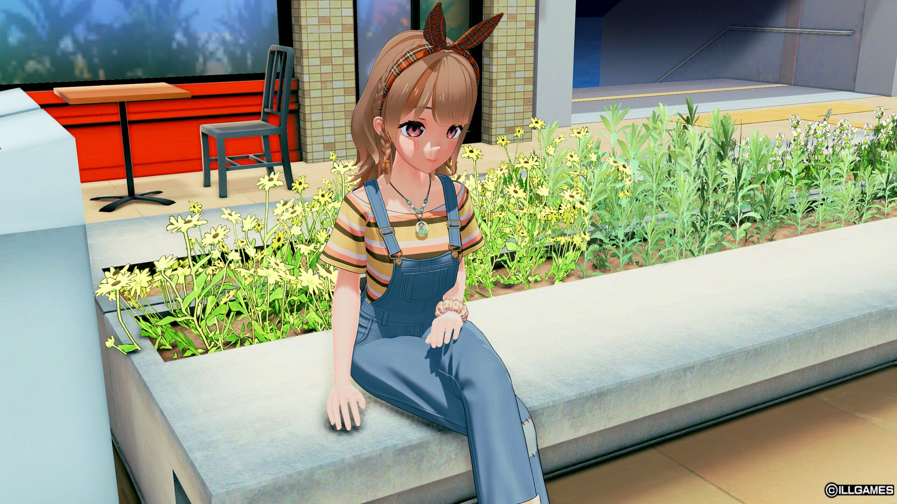

# SVS_FreeRoam

Free roam for **Summer Vacation Scramble**: a third-person camera and controls,
gamepad support, click the ground to walk there, click a character to follow them,
and optional high-poly characters on the map.

A rework of **SVS_3rdPov v0.0.6 by Junh2x**, whose repository is no longer available.
Everything that plugin did still works; this adds a rebuilt camera, mouse-driven
movement, first person, location buttons that follow the doorways they lead to, and
the rest below. See [CREDITS.md](CREDITS.md).

| | |
|---|---|
|  |  |
| Sitting on a bench at the station with someone | Walking around in third person |
|  |  |
| Aiming at someone shows who they are | Force High Poly Characters on the map |

## Requirements

- Summer Vacation Scramble with **BepInEx 6** (IL2CPP, bleeding edge build 6.0.0-be.752
  or a compatible one — the one in SVS-HF_Patch works).
- Optional: **ConfigurationManager** (included in SVS-HF_Patch) to change the settings
  in game; they are also in `BepInEx\config\SVS_FreeRoam.cfg`.

## Install

Extract the release zip into the game folder, or put `SVS_FreeRoam.dll` in
`BepInEx\plugins\` yourself.

**SVS_3rdPov is replaced by this.** If `SVS_3rdPov.dll` is still installed, SVS_FreeRoam
switches it off and tells you on screen; remove it when you can.

## The two camera modes

The one setting that changes how everything else behaves is
**`Camera > Overview Camera Restore`**.

**On** — the ordinary arrangement. The toggle key switches between third-person
and the location's own overview camera, and that camera is put back when you leave
third-person. Location buttons stay where they always were, unless you hold the
Mouse Mode key to bring them up on their markers.

**Off** — third-person is the only view. Neither the toggle nor travelling
somewhere new can drop you into the overview camera. The toggle instead shows and
hides the location buttons on their markers, with the cursor freed so you can click
one.

Locations the plugin has not seen before are learned automatically, custom maps
included, so this keeps working as new maps are installed. The seven story
locations are already known.

## Controls

| Default | Does |
|---|---|
| `F4` | Toggle third-person (or the location buttons, see above) |
| Right click | Interact — talk, use a job spot, take a doorway |
| **Hold left click** | Walk forward |
| Middle click | Walk to the marked character (press again to stop) |
| `Left Shift` | Sprint (or double-tap forward, if enabled) |
| `Left Ctrl` | Walk while held (or double-tap to toggle, if enabled) |
| `C` | Crouch (first person) |
| `Left Alt` | Hold to free the cursor and bring up the location buttons |
| Mouse wheel | Zoom, then optical zoom once fully in |
| *(unbound)* | Reset View: back to the starting distance and field of view |

Every key has an optional **second binding** in the `Hotkeys` section.

**Gamepad** (Xbox-style, or anything Steam Input presents as one), with
`General > Extended Gamepad Support` on (the default):

| Button | Does |
|---|---|
| Left stick | Walk (run when pushed); moves between buttons on screens |
| Right stick | Turn the camera in third person |
| Triggers | Zoom (left in, right out) |
| D-pad | Choose buttons on screen |
| A | Select: press the chosen button, or start choosing; move a conversation on |
| B | Back: fold a list away, leave a screen, stop a walk |
| X | Talk to the nearest character |
| Y | Use the nearest location marker: doorway or activity |
| LB | Toggle third person; on Map Select, Meet Up, options, shortcuts or help: previous screen |
| RB | Sprint; on those screens: next screen |
| Start | Options window |
| Back / View | A map screen of your choice (Meet Up by default), or the character switch button |
| Left stick click | Crouch, when zoomed all the way in |
| Right stick click | Reset view |

Every button can be rebound in `Hotkeys`. Nothing on screen is selected until you
press something, so the controller never gets in the way of the mouse.

`General > Directional Movement In All Views` lets WASD and the left stick move you
in the overview camera and on 2D and custom maps too.

## Clicking the world

Wherever the cursor is free — the overview camera, 2D maps, or third person while the
location buttons are up:

| Default | Does |
|---|---|
| Left click the ground | Walk there |
| Right click a character | Follow them, through doorways too. Click them again, or click elsewhere, to stop |

Settings are in `Click To Walk` and `Click To Follow`.

## Force High Poly Characters

`General > Force High Poly Characters` gives characters on the map their full-detail
models, the ones normally seen only in conversations. It uses much more memory, more
so the more characters there are.

`Movement > Forward Mode` switches walking to right click, which moves interact
onto left click.

## First person

Set `Min Camera Distance` to 0 and scroll all the way in. Your character stops being
drawn below `Hide Character Below Distance`, giving a clean first-person view, and
scrolling further narrows the field of view like a lens. `Hide Character Key`
toggles it at any distance.

## Notes

- **Camera collision** is on by default. It ignores characters and trigger volumes,
  which is what stops it flickering, but it tests against everything else.
- **Activity buttons** (Work, Eat, Study, Change Outfit, Pray) track the first marker
  for their activity on a map, and appear only where the game itself offers them.
- **Action points set to Pop-ups** in the game's graphics options is respected while
  the buttons are on their markers: each label stays hidden until the cursor is
  over its spot on the doorway, then appears and can be clicked.
- **Enable** in the General section takes effect immediately; switching it off
  hands the camera, cursor and buttons back to the game.

## Development

See `FINDINGS.md` for how the game works internally and why the code is arranged as it is.

```bash
dotnet build SVS_FreeRoam.sln
```

Then copy `SVS_FreeRoam\bin\Debug\net6.0\SVS_FreeRoam.dll` into the game's
`BepInEx\plugins\`. The interop assemblies come from your own install:
`dotnet build -p:InteropPath="<game>\BepInEx\SamabakeScramble\interop"`.

## Licence

MIT — see [LICENSE](LICENSE). SVS_FreeRoam grew out of SVS_3rdPov by Junh2x, which
shipped without a licence; see [CREDITS.md](CREDITS.md).
