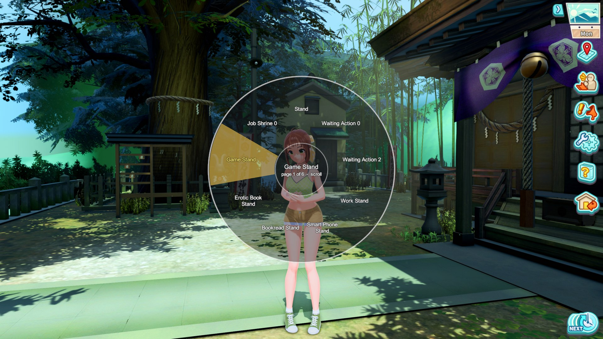
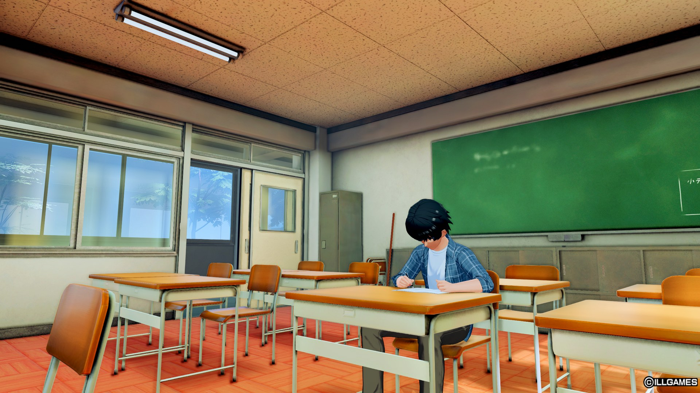

# SVS_FreeRoam

Free roam for **Summer Vacation Scramble**: a third-person camera and controls,
gamepad support, click the ground to walk there, click a character to follow them,
sit on benches and chairs, play idle animations from a wheel, and optional high-poly
characters on the map.

A rework of **SVS_3rdPov v0.0.6 by Junh2x**, whose repository is no longer available.
Everything that plugin did still works; this adds a rebuilt camera, mouse-driven
movement, first person, location buttons that follow the doorways they lead to, and
the rest below. See [CREDITS.md](CREDITS.md).

| | |
|---|---|
|  |  |
| Sitting on a bench at the station with someone | Walking around in third person |
|  |  |
| Aiming at someone shows who they are | Force High Poly Characters on the map |
|  |  |
| The animation wheel: hold, point, let go | Click a desk, chair or bench to use it |

## Requirements

- Summer Vacation Scramble, **up to date**, with **BepInEx 6** (IL2CPP, bleeding edge
  build 6.0.0-be.752 or a compatible one — the one in SVS-HF_Patch works). On an older
  game version parts of the plugin may not work; it says so on screen and lists what is
  missing in `BepInEx\LogOutput.log`.
- Optional: **ConfigurationManager** (included in SVS-HF_Patch) to change the settings
  in game; they are also in `BepInEx\config\SVS_FreeRoam.cfg`.

## Install

Extract the release zip into the game folder, or put `SVS_FreeRoam.dll` in
`BepInEx\plugins\` yourself.

**SVS_3rdPov is replaced by this.** If `SVS_3rdPov.dll` is still installed, SVS_FreeRoam
switches it off and tells you on screen; remove it when you can.

## The two camera modes

The one setting that changes how everything else behaves is
**`Camera > Overview Camera Restore`**.

**On** — the ordinary arrangement. The toggle key switches between third-person
and the location's own overview camera, and that camera is put back when you leave
third-person. Location buttons stay where they always were, unless you hold the
Mouse Mode key to bring them up on their markers.

**Off** — third-person is the only view. Neither the toggle nor travelling
somewhere new can drop you into the overview camera. The toggle instead shows and
hides the location buttons on their markers, with the cursor freed so you can click
one.

Locations the plugin has not seen before are learned automatically, custom maps
included, so this keeps working as new maps are installed. The seven story
locations are already known.

`General > PoV Mode` says where third person is available at all: on 3D maps (the
default), on every map (not recommended: the flat maps were not made for it), or
nowhere.

## Controls in third person

| Default | Does |
|---|---|
| `F4` | Toggle third-person (or the location buttons, see above) |
| Right click | Interact — talk, use a job spot, take a doorway |
| **Hold right click** and move the mouse | Drag the camera: up/down raises it, left/right brings it in and out. In first person it zooms instead |
| **Hold left click** | Walk forward (double-click and hold to sprint) |
| Hold both and move the mouse | Drag the camera forward/back and sideways |
| Middle click | Tap: sit on the seat next to you, or play an idle animation; tap again to get up or stop. Hold: the animation wheel. With a character marked: walk to them |
| `Space` | First person, and from there back out to the starting view |
| `Left Shift` | Sprint (or double-tap a direction and hold) |
| `Left Ctrl` | Walk while held (double-tap to switch between walking and running) |
| `C` | Crouch (first person) |
| `Left Alt` | Hold to free the cursor and bring up the location buttons |
| Mouse wheel | Zoom, then lens zoom once fully in |

Every key has an optional **second binding** in the `Hotkeys` section.
`Movement > Forward Mode` can swap the two mouse buttons (walk with right, interact
and drag with left) or switch mouse walking off.

**Gamepad** (Xbox-style, or anything Steam Input presents as one), with
`General > Extended Gamepad Support` on (the default):

| Button | Does |
|---|---|
| Left stick | Walk (run when pushed); moves between buttons on screens |
| Right stick | Turn the camera in third person |
| Triggers | Zoom (left in, right out) |
| D-pad | Choose buttons on screen |
| A | Select: press the chosen button, or start choosing; move a conversation on |
| B | Back: fold a list away, leave a screen, stop a walk. In first person, with nothing selected: crouch |
| X | Talk to the nearest character |
| Y | Use the nearest location marker: doorway or activity |
| LB | Tap: sit on the seat next to you, or play an idle animation; tap again to get up or stop. Hold: the animation wheel (a stick points, letting go or A plays, RB or the D-pad turns pages). On Map Select, Meet Up, options, shortcuts or help: previous screen |
| RB | Sprint; on those screens: next screen |
| Start | Options window |
| Back / View | A map screen of your choice (Meet Up by default), or the character switch button |
| Left stick click | Toggle third person |
| Right stick click | First person, and back out to the starting view |

Every button can be rebound in `Hotkeys`. Nothing on screen is selected until you
press something, so the controller never gets in the way of the mouse.

`General > Directional Movement In All Views` lets WASD and the left stick move you
in the overview camera and on 2D and custom maps too.

## Clicking the world

Wherever the cursor is free — the overview camera, 2D maps, or third person while the
location buttons are up:

| Default | Does |
|---|---|
| Left click the ground | Walk there |
| Left click a bench, chair or desk | Walk there and sit |
| Right click a character | Follow them, through doorways too. Click them again, or click elsewhere, to stop |
| Hold right click on a character | A wheel: talk, follow, switch to (the last with SVS_CustomGameBalance) |
| Right click yourself | Play an idle animation; click again to stop |
| Hold right click on yourself | The animation wheel |

Settings are in `Clicking Actions`; the buttons are in `Hotkeys`.

## Idle animations and seats

- **Seats.** Benches, chairs, the classroom's desks and the café's tables can be sat on:
  click them, or in third person tap the idle key next to one. A seat someone else is
  using is left to them. Get up by walking away, or tap again.
- **The animation wheel** lists animations to play: hold the idle button, point at one
  and let go. More than fit on one wheel go on pages (mouse wheel). A sitting animation
  chosen next to a seat sits you there first.
- **`Animation Set`** chooses what the wheel lists, and what a tap picks from at random:
  what fits where you are, everything the map's spots offer, every sitting animation,
  one of your three favorite collections, or every animation in the game.
- **Favorites.** With the wheel open, press `1`, `2` or `3` on an animation to put it in
  that collection or take it out. A collection with one animation makes a tap always
  play it.
- Animations come with what they hold (a phone, a book) and the sounds some of them make
  (female characters only: the game has none for males).

## Force High Poly Characters

`General > Force High Poly Characters` gives characters on the map their full-detail
models, the ones normally seen only in conversations. It uses much more memory, more
so the more characters there are.

## First person

Press `Space`, or scroll all the way in (`Min Camera Distance` at 0). Your character
stops being drawn below `Hide Character Below Distance`, giving a clean first-person
view, and scrolling further narrows the field of view like a lens. `Hide Character Key`
toggles it at any distance.

## Notes

- **Camera collision** is on by default. It ignores characters and trigger volumes,
  which is what stops it flickering, but it tests against everything else.
- **Camera Smoothing** makes the camera glide after you; looking around is never delayed.
- **Third Person Blur Strength** (0 by default) turns on depth of field in third
  person, focused on your character, if Depth Of Field is on in the game's graphics
  settings.
- **Activity buttons** (Work, Eat, Study, Change Outfit, Pray) track the first marker
  for their activity on a map, and appear only where the game itself offers them.
- **Action points set to Pop-ups** in the game's graphics options is respected while
  the buttons are on their markers: each label stays hidden until the cursor is
  over its spot on the doorway, then appears and can be clicked.
- **Enable** in the General section takes effect immediately; switching it off
  hands the camera, cursor and buttons back to the game. **Reset All Settings** below
  it puts everything back to the defaults.

## Development

See `FINDINGS.md` for how the game works internally and why the code is arranged as it is.

```bash
dotnet build SVS_FreeRoam.sln
```

Then copy `SVS_FreeRoam\bin\Debug\net6.0\SVS_FreeRoam.dll` into the game's
`BepInEx\plugins\`. The interop assemblies come from your own install:
`dotnet build -p:InteropPath="<game>\BepInEx\SamabakeScramble\interop"`.

## Licence

MIT — see [LICENSE](LICENSE). SVS_FreeRoam grew out of SVS_3rdPov by Junh2x, which
shipped without a licence; see [CREDITS.md](CREDITS.md).
